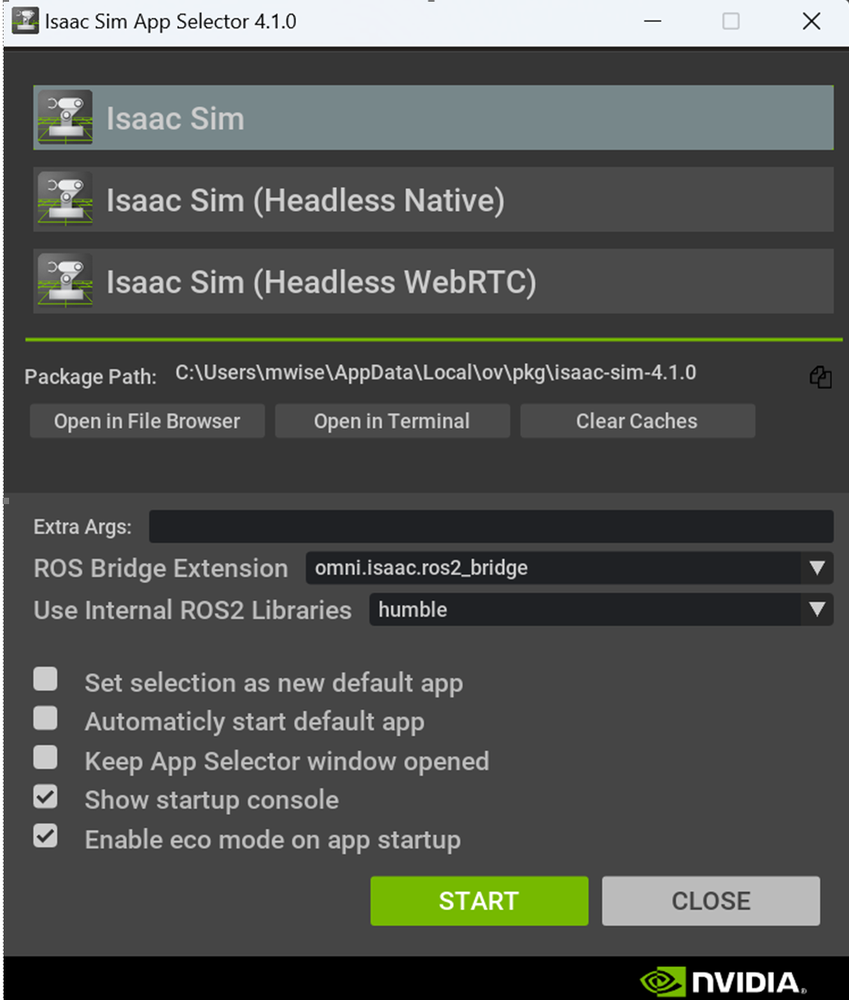
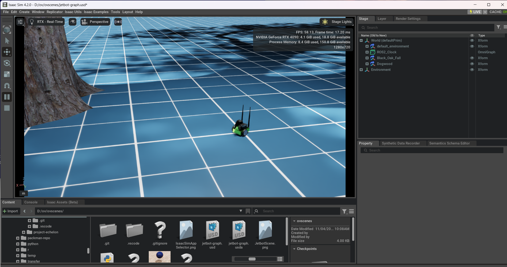
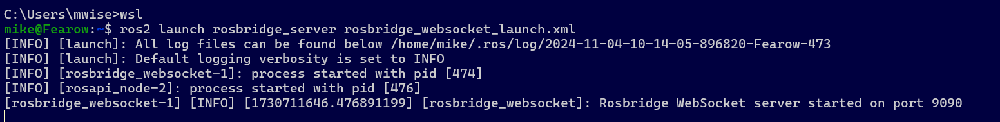
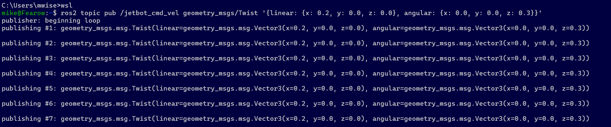

# Omniverse Sscenes
Mike Wise - 4 Nov 2024

## jetbot-graph.usd Scene
- A demo scene to demonstrate rosbridge on Windows11/WSL
- Based on this tutorial (https://www.youtube.com/watch?v=kKIdme5s9WM)
   - I used the Jetbot robot instead of the Huskey because I could find a Huskey URDF
   - Difference was the number of wheels
- Demos communication between ROS 2 and Omniverse's Isaac Sim using Action Graphs

### On WSL side:
- You probably don't want to have python in your path.
- Install ROS 2 Humble
    - Installation: (https://docs.ros.org/en/humble/Installation.html)
    - Test that it works with talker/listener

- Install Ros Bridge
    - `sudo apt install ros-humble-rosbridge-server`

 ### On Windows 11
- Install Isaac Sim (tested with 4.1.0 and 4.2.0)
- Start Isaac Sim with following settings
    - When the Isaac Sim App Selector comes up:
        - The "ROS Bridge Extension" dropdown has `omni.isaac.ros2_bridge`
        - The "Use Internal ROS2 Libraries" dropdown has `humble`
        - Note:
           - This is hard to do - probably a UI bug.
           - The problem is the selections get overwritten by a notification.
           - So You don't see them immediately, when you do they are quite small"
           - You have to click around in the area to find them.
           - But it can be done!

    - What it should look like:
        - 

   -  If the ROS bridge has been started in WSL it should now load without error messages

    - Now load the `jetbot.usd` or `jetbot.usda` scene - you should get a tree and a small green "Jetbot" two-wheeled robot on the standard blue gridded floor.
        - 

    - Hit the Play button (triangle) on the far left.
       - The jetson should fall to the floor.

 ### Back to WSL
- In your WSL window start the ROS2 Bridge
    - `ros2 launch rosbridge_server rosbridge_websocket_launch.xml`
    - you should see the logging output from the rosbridge
    - 

- Now **open another WSL** window and run `ros2 topic pub /jetbot_cmd_vel geometry_msgs/Twist '{linear: {x: 0.2, y: 0.0, z: 0.0}, angular: {x: 0.0, y: 0.0, z: 0.3}}'`
    - you should see the logging output from the publishing actions.
    - 

- The robot should now start running in a circle in the Isaac Sim window.
- Adjust the linear and angular parameters to make it move differently as desired.

## rollaball.usd Scene
- Work on `https://www.youtube.com/watch?v=nTrnCZuG8bU`
